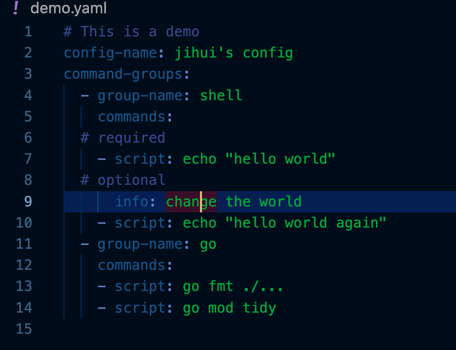

# README
## What is it?
As a developer I usually have so many commands to use every day, it is essential for me to manage them clearly and copy them quickly.

So what I need is a simple UI to click and a .yaml file to define.
### UI

### Yaml

## Instructions / Q&As
### How to install?
Any one is OK
1. Download directly in [script-manager](https://github.com/huangjihui511/script-manager/raw/master/bin/script-manager_1.0.0).
2. Download a verion in [binary files](https://github.com/huangjihui511/script-manager/raw/master/bin/).
3. Execute `go install  github.com/huangjihui511/script-manager@latest` in the terminal.
### How to Initialize?
1. Create environment variable named SM_CONF_PATH.
2. Let it be the script definition yaml file path on your machine.
3. Open the application by double clicking the binary file or using shell command as you like.
4. Click the "Demo" botton which will copy the demo yaml file content to your clipboard.
5. Edit your script definition yaml file refering to the demo.
### How to deploy edits?
1. Edit and save the yaml file.
2. Click the botton named "Update".
## Repository
https://github.com/huangjihui511/script-manager
## Feedback
You are welcome to send emails to `huangjihui511@hotmail.com`